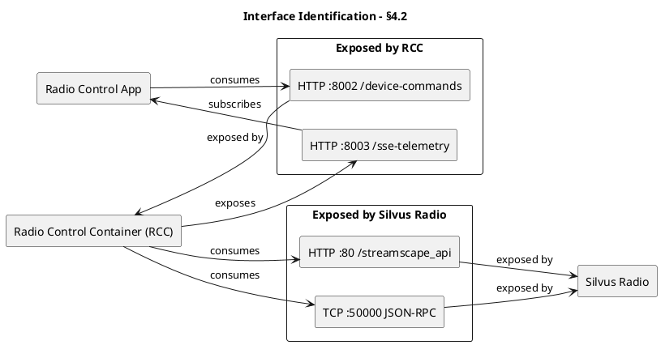
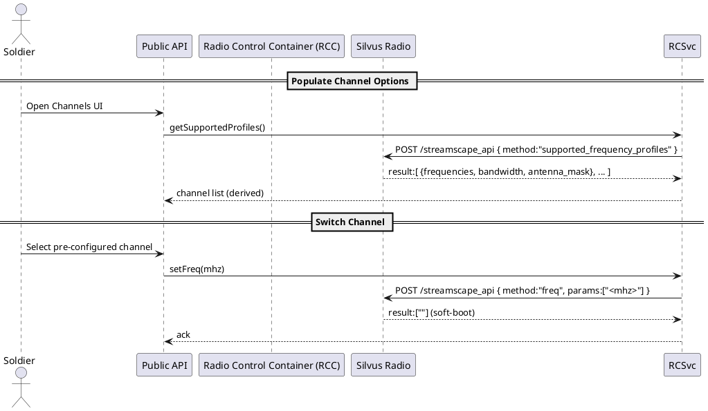
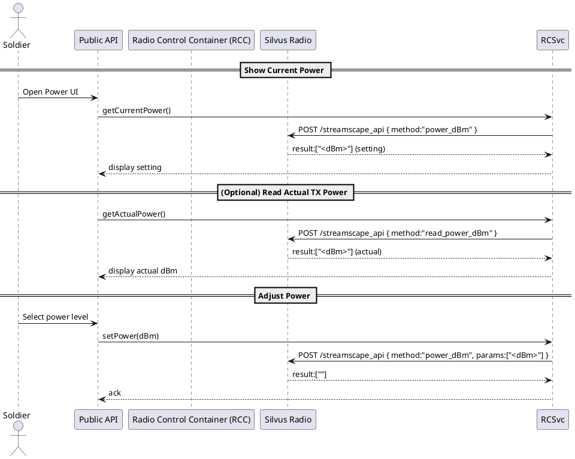
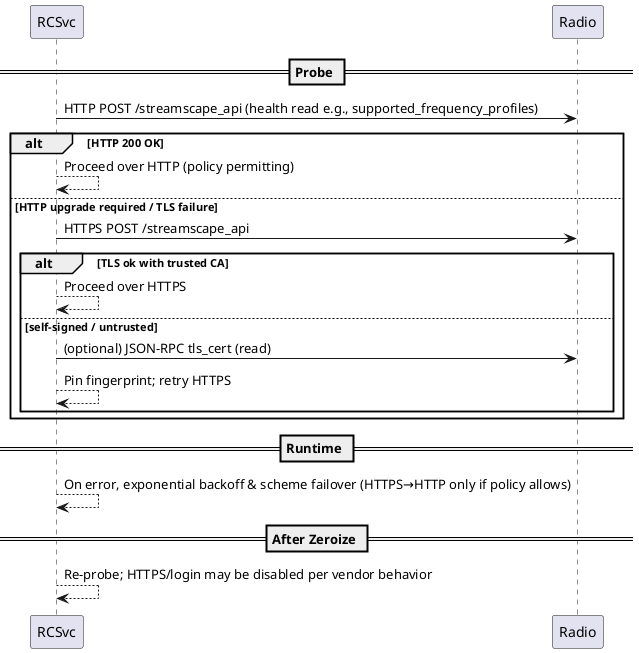

# Interface Control Document (ICD)

## TNN System ↔ Silvus MANET Radio (Logical Interface)

> **Document ID**: [TBD]
>
> **Version**: 0.1 (Draft – Placeholders Only)
>
> **Date**: [YYYY‑MM‑DD]
>
> **Prepared by**: [TBD]
>
> **Classification**: [TBD]

---

## 0. Document Control

- **Revision History**

  | Version | Date       | Author            | Changes                                                                                         |
  | ------- | ---------- | ----------------- | ----------------------------------------------------------------------------------------------- |
  | 0.1     | 2025-09-30 | Carlos Sprekelsen | Verified sections filled; TBDs minimized; antenna mask & bandwidth notes added; diagrams fixed. |

- **Approval Signatures**

  | Role               | Name  | Signature | Date |
  | ------------------ | ----- | --------- | ---- |
  | Project Manager    | [TBD] |           |      |
  | IV&V Lead          | [TBD] |           |      |
  | Security Authority | [TBD] |           |      |

- **Distribution List**: [TBD]

---

## 1. Document Overview

\$1 Purpose This Interface Control Document (ICD) defines the **logical JSON‑RPC interface** between the **TNN** system and the **Silvus MANET Radio** to satisfy **minimal control requirements**:

- Switch among **pre‑configured channels** and **transmit power** levels
- Read supported frequency profiles for UI selection
- (Optional for other containers) GPS read/set, GPS mode/time, and security/maintenance operations (`zeroize`, `radio_reset`, `factory_reset`)

> **Non‑Goals**: Managing HTTPS certificates is **out of scope** for the RCSvc. TLS commands are included only for completeness.

\$1 Scope This document covers:

- Physical connection interfaces (**RNDIS over USB 2.0 HS; TCP/IP**) — **Verified**
- HTTP/JSON‑RPC API for radio control (**port 80, CGI **``**, JSON‑RPC v2.0**) — **Verified**
- Local maintenance channel (\*\*TCP 50000, local only, no auth; `zeroize`, `radio_reset`, `factory_reset`) — **Verified**
- Data formats & message structures (**params: array of strings; results: array of strings/objects**) — **Verified**
- Error handling patterns (``** on successful set; **``** may be string or object**) — **Verified**

Radio Control Requirement (see Annex B(2) – System Requirements Compliance Matrix):

> “The **DTS** system will provide the capability to monitor the GFE tactical radio and control its power and channel selection if the GFE interface allows.”

\$1 Radio‑Related Parameters \$1 Minimum Commands (Core) These commands satisfy the core requirement (“monitor and control power & channel”) and are **verified** in §6:

- `freq (MHz)` — *Sets/reads* the transmit frequency (channel). **Params**: `["<mhz>"]` (string‑encoded number). **Resolution**: 0.1 MHz. **Read result**: `["<mhz>"]`. **Side‑effect**: soft boot.
- `power_dBm (dBm)` — *Sets/reads* the transmit power. **Params**: `["<dBm>"]` (string‑encoded integer 0–39; accuracy 10–39). **Read result**: `["<dBm>"]`. If `enable_max_power=1`, set is ignored.
- `supported_frequency_profiles` — *Reads* allowed frequency/bandwidth/antenna combinations. **Result**: array of objects with `frequencies`, `bandwidth`, `antenna_mask` (see §6.1.2).

**Recommended application flow** (minimal use case):

1. On startup, call `supported_frequency_profiles` to populate UI.
2. Soldier selects a pre‑configured channel → call `freq` with that MHz.
3. Soldier selects a power level → call `power_dBm` with that value.
4. Handle error returns (string or object) per §8.

> **Validation**: Client SHOULD validate inputs against values/ranges derived from `supported_frequency_profiles` and the documented ranges in §7.2. The radio remains authoritative; client validation is advisory.

\$1 Optional Commands (Environment‑Specific) The following commands are **verified** and available; see §6.2 for exact schemas and examples:

- `max_link_distance` — read & set distance cap (meters). See §6.2.3.
- `read_power_dBm` / `read_power_mw` — read actual TX power. See §6.2.1–§6.2.2.
- `gps_coordinates` — read & set lat/lon/alt with ranges. See §6.2.4.
- `gps_mode` — read GPS lock status. See §6.2.5.
- `gps_time` — read GPS-derived timestamp (seconds). See §6.2.6.
- `zeroize` — security reset operation. See §6.2.7.

\$1 Assumptions

> **Policy**: Avoid assumptions. Use explicit placeholders below until verified.

| ASSUMPTION (Placeholder)                  | VALIDATED (TRUE/FALSE) | Evidence/Notes                              |
| ----------------------------------------- | ---------------------- | ------------------------------------------- |
| Radio exposes RNDIS USB network interface | TRUE                   | R1 §HTTP access; §3.4                       |
| Radio maintains persistent configuration  | [TBD]                  | Test case ref [TBD]                         |
| Radio provides HTTP endpoint for JSON‑RPC | TRUE                   | `http://<radio_IP>:80/streamscape_api` (R1) |
| JSON‑RPC version                          | TRUE                   | v2.0 (R1)                                   |

---

## 2. References

| ID | Title                               | Doc No./URL | Version | Date               | Publisher                                                                  |
| -- | ----------------------------------- | ----------- | ------- | ------------------ | -------------------------------------------------------------------------- |
| R1 | **StreamCaster Programming Manual** | [N/A]       | **4.3** | **September 2023** | **Silvus Technologies, 10990 Wilshire Blvd, #1500, Los Angeles, CA 90024** |
| R2 | JSON‑RPC Specification              | [N/A]       | 2.0     | [N/A]              | [N/A]                                                                      |
| R3 | Physical ICD — TNN ↔ Silvus         | [TBD]       | [TBD]   | [TBD]              | [TBD]                                                                      |
| R4 | Security Policy / Zeroization SOP   | [TBD]       | [TBD]   | [TBD]              | [TBD]                                                                      |

---

## 3. Definitions, Acronyms and Abbreviations

- **API** — Application Programming Interface
- **GFE** — Government‑Furnished Equipment
- **ICD** — Interface Control Document
- **JSON‑RPC** — JSON Remote Procedure Call (version 2.0 herein)
- **RNDIS** — Remote Network Driver Interface Specification (USB virtual NIC)
- **TNN** — [System name expansion TBD]
- **Zeroize** — Security reset to default credentials/keys/profiles

---

## 4. System Context and Interface Overview

\$1 Context Diagram (Authoritative)

> **Verified context for Silvus control and container ports.**

```plantuml
@startuml
!include katim-swad-1.0.puml
title Digital Tactical Soldier System - Context (Silvus Focus)
left to right direction
rectangle "Digital Tactical Soldier System" as DTS {
  actor "Soldier" as User
  rectangle "Android Terminal" as Terminal {
    component "Radio Control App" as App
  }
  rectangle "Host Hub (Edge Computer)" as Hub {
    component "**Radio Control Container (RCC)**" as RCC <<highlight>>
  }
}
component "Silvus MANET Radio
(HTTP JSON-RPC)
Channel/Power Control" as Silvus
component "Harris MANET Radio
(ICD TBD)
Channel/Power Control" as Harris
component "Thales MANET Radio
(ICD TBD)
Channel/Power Control" as Thales

User --> Terminal : Operates
User --> App : Uses
App --> RCSvc : Device Commands (HTTP :8002)
RCSvc --> App : SSE Telemetry (HTTP :8003)
Silvus --> RCSvc : Radio Channel/Power
(HTTP POST /streamscape_api)
Harris --> RCSvc : Radio Channel/Power
(Protocol per ICD)
Thales --> RCSvc : Radio Channel/Power
(Protocol per ICD)
@enduml
```

\$1 Interface Overview (Updated)

| Interface                                 | Direction                                   | Transport                      | Endpoint                                                                                 | Auth                  | Notes                                                               |
| ----------------------------------------- | ------------------------------------------- | ------------------------------ | ---------------------------------------------------------------------------------------- | --------------------- | ------------------------------------------------------------------- |
| **Radio Control App ↔ RCSvc (Container)** | App→RCSvc (commands), RCSvc→App (SSE)       | IPC over **HTTP**              | `http://<rcsvc_host>:8002` (device commands), `http://<rcsvc_host>:8003` (SSE telemetry) | [TBD]                 | 8002: command API; 8003: server‑sent events (telemetry/changes)     |
| TNN (Client) ↔ Silvus (Server)            | Requests: TNN→Silvus; Responses: Silvus→TNN | RNDIS over USB 2.0 HS (TCP/IP) | `http://<radio_IP>:80/streamscape_api`                                                   | [TBD]                 | JSON‑RPC 2.0 over HTTP POST                                         |
| TNN (Client) ↔ Silvus Local Maintenance   | Requests: TNN→Silvus; Responses: Silvus→TNN | **TCP** (local iface only)     | `<radio_IP>:50000`                                                                       | **None (local only)** | `zeroize`, `radio_reset`, `factory_reset`; not accessible over mesh |

\$1 Interface Identification Diagram

> Provided/consumed interfaces for each component.



---

## 5. Transport & Encoding — **Verified**

### Transport

#### RNDIS Network Interface — **Verified**

- **Connection Type**: **USB 2.0 HS (480 Mb/s)**
- **Network Protocol**: **TCP/IP over RNDIS**
- **IP Configuration**:
  - **Hub**: `172.20.0.1/16`
  - **Radio**: `172.20.<XX>.<YY>/16`
  - **Subnet Mask**: `255.255.0.0`
- **Service Port**: `80` (HTTP JSON‑RPC)

### Message Envelope (JSON‑RPC 2.0)

- **Logical Protocol**: JSON‑RPC v2.0
- **Carrier**: **RNDIS over USB 2.0 HS (480 Mb/s)**
- **Network Stack**: **TCP/IP**
- **HTTP Endpoint**: ``

\$1 Message Envelope (JSON‑RPC 2.0) **Request**

```json
{
  "jsonrpc": "2.0",
  "method": "<command>",
  "params": ["<param1>", "<param2>"],
  "id": "<client-generated>"
}
```

- `params` is **optional** and is a **JSON array of strings**.

**Response – Success**

```json
{
  "jsonrpc": "2.0",
  "result": [ /* array elements (types per command) */ ],
  "id": "<same id>"
}
```

**Response – Error**

```json
{
  "jsonrpc": "2.0",
  "error": { /* object fields TBD */ },
  "id": "<same id>"
}
```

> **Vendor note**: Certain command‑level failures MAY return `error` as a **string** (see §6.0). Treat this as vendor‑specific behavior.

\$1 HTTP Access

- Access API via **HTTP POST** on CGI command `streamscape_api` at port **80**.
- Content‑Type: `application/json`.
- **Access methods (per R1)**:
  - **RNDIS/USB** (this ICD’s primary path).
  - **Ethernet**: Bring up the radio with IP `172.20.XX.XX` and connect a laptop to the Ethernet interface.
- Example (curl):

```bash
curl -i -X POST \
  -H "Content-Type: application/json" \
  -d '{"jsonrpc":"2.0","method":"<command>","params":["param1","param2"],"id":"<uniqueID>"}' \
  http://<radio_IP>/streamscape_api
```

\$1 Local Maintenance Channel (Verified)

- **Service**: JSON‑RPC server on **TCP port 50000**.
- **Scope**: **Only** accepts connections from **local network interfaces** (Ethernet, USB/RNDIS). **Not reachable over the mesh.**
- **Authentication**: **Not required** on this local channel.
- **Implemented Methods**: `zeroize` (same semantics as HTTP API), `radio_reset` (reboot after \~3s), `factory_reset` (restore factory defaults; requires reboot).

---

## 6. Method Specifications (Logical API)

> Sources: **R1** unless otherwise stated. Sections below capture **verified details**. Unspecified fields remain **TBD**.

\$1 Command Semantics — **Verified (R1)**

- Unless otherwise specified, each command **reads or sets** a variable.
- Place command name in `method`.
- **Read**: if **no **`` are provided → the radio returns the current value in ``** as a JSON array** (string elements).
- **Set**: if `` is present → the radio attempts to set the variable to the provided value(s). On success, ``** = **`` (array containing an empty string). On failure, `` is set (string per *Commands and Responses*; may also appear as an object per API overview).

\$1 Core Commands — **Verified** \$1 `freq`

- **Purpose**: Set/read the current RF frequency.
- **Units**: MHz
- **Resolution**: 0.1 MHz
- **Range**: Use `supported_frequency_profiles` to determine allowed values.
- **Side‑effect**: **Soft boot** — driver/services reboot and become unavailable during execution. Avoid concurrent API calls.
- **Read** (no params):
  - **Request**
    ```json
    {"jsonrpc":"2.0","method":"freq","id":"<id>"}
    ```
  - **Success Response**
    ```json
    {"result":["2492"],"id":"<same id>"}
    ```
- **Set** (with params):
  - **Params**: `[ "<frequency>" ]` where `<frequency>` is a number encoded as string (e.g., "2490").
  - **Request**
    ```json
    {"jsonrpc":"2.0","method":"freq","params":["2490"],"id":"<id>"}
    ```
  - **Success Response**
    ```json
    {"result":[""] ,"id":"<same id>"}
    ```
  - **Failure Response**
    ```json
    {"error":"<string message>","id":"<same id>"}
    ```
- **Example (curl)**
  ```bash
  curl -i -X POST -H 'Content-Type: application/json' \
    -d '{"jsonrpc":"2.0","method":"freq","id":"sbkb5u0c"}' \
    http://172.20.XX.XX/streamscape_api
  ```

\$1 `supported_frequency_profiles`

- **Purpose**: Read the supported frequency/bandwidth/antenna mask combinations.
- **Access**: **Read‑only** (no params).
- **Response Shape**: `result` is a JSON **array** of **objects**.
  - Each object contains:
  - `frequencies`: array of strings using the format **same as **``** option in Spectrum Scan Start**: `"<start_mhz>:<step_mhz>:<end_mhz>"`, or single frequencies like `"4700"`.
  - `bandwidth`: string; `"-1"` means applicable to all supported bandwidths (**5 and 20 MHz** per R1 4.3.5 Rev 08/01/2023).
  - `antenna_mask`: **hex string 1..F**. Example: `"D"` selects RX channels **1, 3, and 4**. (Mask semantics align with TX/RX antenna commands; full mapping TBD.)

**Frequency Profile Parsing Rules:**
- **Range format**: `"<start_mhz>:<step_mhz>:<end_mhz>"` (e.g., `"2200:20:2380"`)
- **Single frequency**: `"<frequency_mhz>"` (e.g., `"4700"`)
- **Units**: All frequencies in MHz
- **Normalization**: System shall expand ranges into explicit frequency lists, sort and deduplicate, then intersect with regional constraints per Architecture §13
- **Read** (no params):
  - **Request**
    ```json
    {"jsonrpc":"2.0","method":"supported_frequency_profiles","id":"r2"}
    ```
  - **Success Response** (example)
    ```json
    {"result":[
      {"antenna_mask":"15","bandwidth":"-1","frequencies":["2200:20:2380","4700"]},
      {"antenna_mask":"3","bandwidth":"-1","frequencies":["4420:40:4700"]},
      {"antenna_mask":"12","bandwidth":"-1","frequencies":["4700:20:4980"]}
    ],"id":"r2"}
    ```
- **Example (curl)**
  ```bash
  curl -i -X POST -H 'Content-Type: application/json' \
    -d '{"jsonrpc":"2.0","method":"supported_frequency_profiles","id":"r2"}' \
    http://172.20.XX.XX/streamscape_api
  ```

#### `power_dBm`

**Transmit Power**\
• **Command**: power\_dBm\
• **Parameter**: `[ "power" ]`, where **power is an integer number**.\
• **Description**: Sets/reads the current transmit power of the radio. If "enable\_max\_power" is 1, the value of power\_dBm is ignored.\
• **Unit**: dBm\
• **Range**: 0-39, note however that the actual power output is accurate only between 10-39 dBm. The upper limits of power may vary depending on radio model and installed license.\
• **Resolution**: 1\
• **Default**: 30 dBm\
• **Read Output format**: ["10"], integer value in quotes

Example of commands/outputs, any commands should be in a single line: Read current TX power setting:

```bash
curl -i -X POST -d '{"jsonrpc":"2.0","method":"power_dBm","id":"r3"}' http://172.20.XX.XX/streamscape_api
```

Output:

```
HTTP/1.1 200 OK
Content-Length:  45
Content-Type: application/json

{"result":["30"],"id":"r3"}
```

\$1 Optional Commands

\$1 `read_power_dBm`

- **Purpose**: Read the **actual transmitted total output power** in dBm.
- **Access**: **Read‑only** (no params).
- **Response** (example)
  ```json
  {"result":["28"],"id":"r4"}
  ```
- **Example (curl)**
  ```bash
  curl -i -X POST -H 'Content-Type: application/json' \
    -d '{"jsonrpc":"2.0","method":"read_power_dBm","id":"r4"}' \
    http://172.20.XX.XX/streamscape_api
  ```

\$1 `read_power_mw`

- **Purpose**: Read the **actual transmitted total output power** in milliwatts.
- **Access**: **Read‑only** (no params).
- **Response** (example)
  ```json
  {"result":["630"],"id":"r5"}
  ```
- **Example (curl)**
  ```bash
  curl -i -X POST -H 'Content-Type: application/json' \
    -d '{"jsonrpc":"2.0","method":"read_power_mw","id":"r5"}' \
    http://172.20.XX.XX/streamscape_api
  ```

\$1 `max_link_distance`

- **Purpose**: Set/read the **maximum link distance** for the radio; should be synchronized across all radios in the network.
- **Units**: meters
- **Resolution**: 1
- **Range**: 0–1,000,000
- **Default**: 1000
- **Read** (no params):
  - **Request**
    ```json
    {"jsonrpc":"2.0","method":"max_link_distance","id":"r6"}
    ```
  - **Success Response**
    ```json
    {"result":["5000"],"id":"r6"}
    ```
- **Set** (with params):
  - **Params**: `[ "<distance_m>" ]` where `<distance_m>` is an **integer** encoded as string.
  - **Request**
    ```json
    {"jsonrpc":"2.0","method":"max_link_distance","params":["5000"],"id":"<id>"}
    ```
  - **Success Response**
    ```json
    {"result":[""] ,"id":"<same id>"}
    ```
  - **Failure Response**
    ```json
    {"error":"<string message>","id":"<same id>"}
    ```
- **Example (curl)**
  ```bash
  curl -i -X POST -H 'Content-Type: application/json' \
    -d '{"jsonrpc":"2.0","method":"max_link_distance","id":"r6"}' \
    http://172.20.XX.XX/streamscape_api
  ```

\$1 `gps_coordinates`

- **Purpose**: Set/read **GPS coordinates**.
- **Params (set)**: `[ "<lat>", "<lon>", "<alt_m>" ]` — three **floating‑point** numbers encoded as strings.
- **Ranges**:
  - Latitude: −90 to 90
  - Longitude: −180 to 180
  - Altitude: −12400 to 42000 (meters)
- **Default**: `34.057, -118.447, 0`
- **Read** (no params):
  - **Request**
    ```json
    {"jsonrpc":"2.0","method":"gps_coordinates","id":"r7"}
    ```
  - **Success Response**
    ```json
    {"result":["34.057","-118.447","0"],"id":"r7"}
    ```
- **Set** (with params):
  - **Request**
    ```json
    {"jsonrpc":"2.0","method":"gps_coordinates","params":["34.057","-118.447","0"],"id":"<id>"}
    ```
  - **Success Response**
    ```json
    {"result":[""] ,"id":"<same id>"}
    ```
  - **Failure Response**
    ```json
    {"error":"<string message>","id":"<same id>"}
    ```
- **Example (curl)**
  ```bash
  curl -i -X POST -H 'Content-Type: application/json' \
    -d '{"jsonrpc":"2.0","method":"gps_coordinates","id":"r7"}' \
    http://172.20.XX.XX/streamscape_api
  ```

\$1 `gps_mode`

- **Purpose**: Read **GPS lock status**.
- **Access**: **Read‑only** (no params).
- **Values** (string in `result` array): `"unlocked"`, `"locked-1d"`, `"locked-2d"`, `"locked-3d"`.
- **Read** (no params):
  - **Request**
    ```json
    {"jsonrpc":"2.0","method":"gps_mode","id":"r8"}
    ```
  - **Success Response**
    ```json
    {"result":["locked-3d"],"id":"r8"}
    ```
- **Example (curl)**
  ```bash
  curl -i -X POST -H 'Content-Type: application/json' \
    -d '{"jsonrpc":"2.0","method":"gps_mode","id":"r8"}' \
    http://172.20.XX.XX/streamscape_api
  ```

\$1 `gps_time`

- **Purpose**: Read **GPS‑provided timestamp** in seconds.
- **Access**: **Read‑only** (no params).
- **Response** (example)
  ```json
  {"result":["4561387.1654"],"id":"r9"}
  ```
- **Example (curl)**
  ```bash
  curl -i -X POST -H 'Content-Type: application/json' \
    -d '{"jsonrpc":"2.0","method":"gps_time","id":"r9"}' \
    http://172.20.XX.XX/streamscape_api
  ```

\$1 `zeroize`

- **Purpose**: Perform a security reset.
- **Access**: **Write‑only** (no params).
- **Behavior** (verified):
  - Sets **login passwords** and **all security keys** to their defaults.
  - **Erases all settings profiles**.
  - If **FIPS mode is off**, **turns off HTTPS and login**.
  - Starting with **v4.0.3.0**, deletes all existing users and creates three users:
    - `admin` (access level: **admin**)
    - `basic` (access level: **basic**)
    - `advanced` (access level: **advanced**) with default password **"HelloWorld"**.
- **Request** (no params):
  ```json
  {"jsonrpc":"2.0","method":"zeroize","id":"<id>"}
  ```
- **Response**: On success `result:[""]`; on failure `error:"<string>"`.
- **Operational Note**: Expect service interruption and re‑authentication workflow after execution.
- **Example (curl)**
  ```bash
  curl -i -X POST -H 'Content-Type: application/json' \
    -d '{"jsonrpc":"2.0","method":"zeroize","id":"rz1"}' \
    http://<radio_IP>/streamscape_api
  ```

\$1 `radio_reset`

- **Purpose**: Reboot the radio after \~3 seconds.
- **Access**: Write‑only; available on **local JSON‑RPC TCP port 50000** (see §5.4). *(Availability via HTTP may vary by firmware.)*
- **Request**
  ```json
  {"jsonrpc":"2.0","method":"radio_reset","id":"<id>"}
  ```
- **Response**: On success `result:[""]`; expect connection drop shortly after.

\$1 `factory_reset`

- **Purpose**: Reset **all radio settings to factory defaults**.
- **Access**: Write‑only; available on **local JSON‑RPC TCP port 50000** (see §5.4).
- **Post‑condition**: Defaults take effect **after reboot**; trigger `radio_reset` manually if needed.
- **Request**
  ```json
  {"jsonrpc":"2.0","method":"factory_reset","id":"<id>"}
  ```
- **Response**: On success `result:[""]`.

\$1 TLS Management (Included for completeness; not used by RCSvc)

> **Note**: Per program guidance, certificate management is **not** part of the RCSvc use case; commands are documented for completeness only.

\$1 `tls_cert`

- **Purpose**: Read or replace the HTTPS certificate.
- **Access**: **Readable and writeable**.
- **Read (no params)**
  ```json
  {"jsonrpc":"2.0","method":"tls_cert","id":"tls1"}
  ```
  **Response**
  ```json
  {"result":["my_radio_tls_cert
  ```

"],"id":"tls1"}

````
- **Set (with params)**
- **Params**: `["<your_tls_cert>"]`
```json
{"jsonrpc":"2.0","method":"tls_cert","params":["<your_tls_cert>"],"id":"tls2"}
````

**Response**: `{"result":[""] ,"id":"tls2"}` on success.

\$1 `generate_tls_cert`

- **Purpose**: Create a **new HTTPS certificate** and replace the old one.
- **Access**: **Write‑only** (no params).
- **Request**
  ```json
  {"jsonrpc":"2.0","method":"generate_tls_cert","id":"tls3"}
  ```
- **Response**
  ```json
  {"result":["my_radio_tls_cert
  ```

"],"id":"tls3"}

````

---


## Data Models
$1 Common Types (per verified API)
| Type | Encoding | Description | Example `result` |
|---|---|---|---|
| `MHz` | **string** in array | RF frequency in megahertz | `["2492"]` |
| `dBm` | **string** in array | Transmit power setting (0–39) | `["30"]` |
| `mW` | **string** in array | Actual TX power in milliwatts | `["630"]` |
| `DistanceMeters` | **string** in array | Max link distance (0–1,000,000) | `["5000"]` |
| `LatLonAlt` | **three strings** in array | GPS latitude, longitude, altitude | `["34.057","-118.447","0"]` |
| `GpsMode` | **string** in array | `unlocked|locked-1d|locked-2d|locked-3d` | `["locked-3d"]` |
| `UnixSeconds` | **string** in array | GPS time in seconds (may be fractional) | `["4561387.1654"]` |
| `AntennaMask` | **hex string** | RX/TX channel selection bitmask; valid `1..F` | `"D"` → channels 1,3,4 |
| `BandwidthMHz` | **string** | Supported bandwidths; `-1` means all | `"5"`, `"20"`, or `"-1"` |

> **Note**: The vendor returns all values as **strings inside a JSON array**. When setting values, provide **string-encoded** numbers in `params` arrays.

$1 Validation Rules
- Frequency step/resolution: **0.1 MHz** (per `freq`). Other constraints derived from `supported_frequency_profiles`.
- Supported bandwidths: **5 MHz**, **20 MHz** (when `bandwidth` = `-1`, both apply).
- Power setting valid range: **0–39 dBm**; accuracy typically **10–39 dBm**.
- Distance valid range: **0–1,000,000 m**.
- GPS ranges: **Lat −90..90**, **Lon −180..180**, **Alt −12400..42000**.

---

## 8. Error Handling
$1 Vendor Behavior (Verified)
- Command‑level failures may return **`error` as a string** (manual section *Commands and Responses*).
- The general API description states `error` is an **object** (manual *API overview*). **Client MUST accept both forms**.
- On successful **set** operations, `result` is the **empty string inside an array**: `[""]`.

$1 JSON‑RPC Compatibility
- Standard JSON‑RPC error object usage (code/message/data) remains **TBD** pending further observation; client SHOULD gracefully handle both formats.

$1 Example Error (string)
```json
{"error":"OUT_OF_RANGE","id":"abc-123"}
````

- Standard JSON‑RPC error object usage (code/message/data) remains **TBD** pending further observation; client SHOULD gracefully handle both formats.

\$1 Example Error (string)

```json
{"error":"OUT_OF_RANGE","id":"abc-123"}
```

\$1 Error Input Ambiguity \(Mirror Architecture §8\.5\.1\)

Radio vendors may return errors in **textual** or **structured** formats. The system shall provide deterministic mapping into the normalized set `{INVALID_RANGE, BUSY, UNAVAILABLE, INTERNAL}` while preserving diagnostic information.

**Normalization Requirements:**
- Each vendor error must map to exactly one container code plus a human-readable message.
- The original vendor payload shall be preserved in a **diagnostic details** field (opaque to the client).
- Mapping logic shall be consistent across adapter implementations.
- Error envelope fields are defined in the **OpenAPI** specification; this section covers radio-side normalization rules only.

---

## 9. Security

- **Access Control Surfaces**:
  - **HTTP API (port 80)**: JSON‑RPC over HTTP (local networks). **Authentication**: [TBD per deployment]; manual indicates API is reachable when locally connected; confirm if auth is enforced in your build.
  - **Local Maintenance JSON‑RPC (TCP 50000)**: **Local interfaces only (Ethernet, USB/RNDIS)**; **no authentication** required. **Not accessible over mesh.**
- **Confidentiality/Integrity**: [TBD] (e.g., segment local mgmt VLAN/USB, host firewall rules).
- **Zeroization**: See §6.2.7; after execution, services/credentials change; re‑auth/re‑provision workflows required.
- **Audit/Logging**: [TBD] (log invocations of `zeroize`, `factory_reset`, `radio_reset` with source IP and timestamp).

---

## 10. Performance & Timing (Placeholders)

- **Latency Targets**: **TBD**
- **Rate Limits**: **TBD**
- **State Propagation Times**: **TBD**

---

## 11. Compliance & Verification

### 11.1 Test Cases

| Test ID | Requirement | ICD Method | Expected Result | Status |
|---------|-------------|-----------|-----------------|--------|
| ICD-001 | Set valid frequency | §6.1.1 `freq` | `result:[""]` | [PASS/FAIL] |
| ICD-002 | Set out-of-range power | §6.1.3 `power_dBm` | `error` string | [PASS/FAIL] |
| ICD-003 | Read frequency profiles | §6.1.2 `supported_frequency_profiles` | `result` array with objects | [PASS/FAIL] |
| ICD-004 | Soft-boot recovery | §6.1.1 `freq` | Radio returns to online | [PASS/FAIL] |
| ICD-005 | Local maintenance port | §5.4 TCP 50000 | Commands on TCP 50000 work | [PASS/FAIL] |
| ICD-006 | Set valid power | §6.1.3 `power_dBm` | `result:[""]` | [PASS/FAIL] |
| ICD-007 | Read current frequency | §6.1.1 `freq` | `result:["<mhz>"]` | [PASS/FAIL] |
| ICD-008 | Read current power | §6.1.3 `power_dBm` | `result:["<dBm>"]` | [PASS/FAIL] |
| ICD-009 | Set invalid frequency | §6.1.1 `freq` | `error` string | [PASS/FAIL] |
| ICD-010 | JSON-RPC error handling | §8.1 | Both string and object errors handled | [PASS/FAIL] |

### 11.2 Test Execution Requirements

**Prerequisites:**
- Radio connected via RNDIS/USB or Ethernet
- Radio IP address accessible from test system
- Test system configured with appropriate network access

**Test Environment:**
- Use `curl` commands as documented in §6.1.1–§6.1.3
- Validate JSON-RPC v2.0 compliance
- Test both HTTP (port 80) and local maintenance (TCP 50000) channels

**Success Criteria:**
- All test cases must return expected results
- Error handling must match documented behavior
- Soft-boot recovery must complete within documented timeframes

### 11.3 Conformance Matrix

| Requirement ID | Statement | Method (§) | Test (§) | Status |
| -------------- | ---------- | ---------- | -------- | ------ |
| R-CTRL-001 | DTS shall control radio frequency | 6.1.1 | ICD-001, ICD-004, ICD-007, ICD-009 | [TBD] |
| R-CTRL-002 | DTS shall control radio power | 6.1.3 | ICD-002, ICD-006, ICD-008 | [TBD] |
| R-MON-003 | DTS shall read current power | 6.1.3 | ICD-008 | [TBD] |
| R-CAP-004 | DTS shall read frequency profiles | 6.1.2 | ICD-003 | [TBD] |
| R-MAINT-005 | DTS shall support local maintenance | 5.4 | ICD-005 | [TBD] |

---

## 12. Manageability & Telemetry

- **Command Path**: **App → RCC** on **:8002** for device commands. *(Container/Public API scope; not part of radio ICD)*
- **Telemetry Path**: **RCC → App** via **SSE on :8003** for state changes. **Note**: SSE is **App↔Container design**, not a radio interface.
- **Radio Polling**: RCC polls the **radio HTTP API** and **transforms** changes into SSE for the App. If SSE is unavailable, App may poll RCC. **Exact cadence**: *[TBD by performance testing]* (e.g., 1–5 s active; 10–30 s background).
- **Soft‑boot Handling**: After `freq` set, RCC suppresses further radio calls until the radio's HTTP endpoint recovers (retry/backoff). **Timeout/backoff values**: *[TBD lab]*.

---

## 13. Interoperability Considerations (Placeholders)

- **Regional Profiles**: **TBD**
- **Versioning Policy**: **TBD**

---

## 14. Open Issues (TDR)

| ID     | Issue                                                                  | Status                  | Resolution / Next Step                                                                                                                                                      |
| ------ | ---------------------------------------------------------------------- | ----------------------- | --------------------------------------------------------------------------------------------------------------------------------------------------------------------------- |
| OI‑001 | Confirm JSON‑RPC version                                               | **CLOSED (2025‑09‑30)** | Verified **v2.0** per R1; schema encoded in §5.2 and §6.0.                                                                                                                  |
| OI‑002 | Document transport (RNDIS/Serial)                                      | **CLOSED (2025‑09‑30)** | Transport is **RNDIS over USB 2.0 HS (TCP/IP)**; HTTP port **80** endpoint; local maintenance **TCP 50000**. See §5.1 and §5.4.                                             |
| OI‑003 | Define schemas for `freq`, `power_dBm`, `supported_frequency_profiles` | **CLOSED (2025‑09‑30)** | Schemas and examples added in §6.1.1–§6.1.3; validation in §7.2.                                                                                                            |
| OI‑004 | Validate optional method availability                                  | **CLOSED (2025‑09‑30)** | Verified: `read_power_dBm`, `read_power_mw`, `max_link_distance`, `gps_coordinates`, `gps_mode`, `gps_time`, `zeroize`; plus local `radio_reset`/`factory_reset`. See §6.2. |

> Remaining gaps are tracked in the main text as **[TBD]** (e.g., auth policy, persistence after reset, antenna bit map table, regional constraints, `enable_max_power` control, timing/backoff values).

---

## Annex A — Glossary

- **Antenna Mask** — Hex bitmask (`1`..`F`) selecting RX/TX channels; e.g., `D` selects channels **1, 3, 4**. Returned in `supported_frequency_profiles`.
- **Bandwidth** — Channel bandwidth in MHz; `-1` indicates **all supported bandwidths** (5 and 20 MHz).
- **JSON‑RPC v2.0** — Standard JSON Remote Procedure Call protocol used by the radio API; requests carry `method`, optional `params` (array of strings), and `id`.
- **Local Maintenance Channel** — JSON‑RPC service on TCP **50000** accessible **only via local interfaces** (Ethernet/USB); implements `zeroize`, `radio_reset`, `factory_reset`; **no auth**.
- **Profile (Frequency Profile)** — Object describing allowed frequency ranges (`frequencies`), `bandwidth`, and `antenna_mask` supported by the board.
- **RCC (Radio Control Container)** — The container service that mediates between the App and the radio, exposing **:8002** for device commands and **:8003** for SSE telemetry.
- **Result/Params Encoding** — Radio returns values as **strings in JSON arrays**; set operations send **string‑encoded** values in `params` arrays; success returns `[""]`.
- **Soft‑boot** — Temporary service interruption that occurs when applying certain settings, e.g., `freq`; suppress further calls until the radio endpoint recovers.
- **Zeroize** — Operation that resets credentials/keys and erases settings; on v4.0.3.0, recreates `admin`, `basic`, `advanced` users with default password **"HelloWorld"**.

## Annex B(2) — System Requirements Compliance Matrix (Extract)

| Requirement ID | Statement                         | Method (§) | Test (§) | Status |
| -------------- | --------------------------------- | ---------- | -------- | ------ |
| R‑CTRL‑001     | DTS shall control radio frequency | 6.1.1      | ICD-001, ICD-004, ICD-007, ICD-009 | [TBD]  |
| R‑CTRL‑002     | DTS shall control radio power     | 6.1.3      | ICD-002, ICD-006, ICD-008 | [TBD]  |
| R‑MON‑003      | DTS shall read current power      | 6.1.3      | ICD-008  | [TBD]  |
| R‑CAP‑004      | DTS shall read frequency profiles | 6.1.2      | ICD-003  | [TBD]  |
| R‑MAINT‑005    | DTS shall support local maintenance | 5.4      | ICD-005  | [TBD]  |

## Annex C — UML Flows (Operational)

### C.1 Channel Selection Workflow



### C.2 Power Adjustment Workflow



### C.3 HTTPS Access Readiness Flow (Optional)

> The RCSvc **does not manage certificates** by default. This flow ensures access does not fail when HTTPS is enforced or policy requires it.



## Annex D — State Tables (Placeholders)

| State | Event | Next State | Notes |
| ----- | ----- | ---------- | ----- |
| [TBD] | [TBD] | [TBD]      | [TBD] |

---

> **Editing Rule**: Do not replace placeholders with guesses. Only fill fields after validation against the Silvus vendor ICD and lab tests.

---

## 15. Capability Ingest & Refresh

**Startup Capability Ingest:**
- On radio attachment, the system shall call `supported_frequency_profiles` to ingest radio capabilities.
- Capabilities shall be stored and used to derive channel mappings per Architecture §13.

**Runtime Capability Refresh:**
- When radios re-attach or capabilities change, the system shall re-ingest supported frequency profiles.
- Re-derivation of channels shall occur upstream per Architecture §13.
- Capability changes shall trigger appropriate events to notify clients.

**Refresh Triggers:**
- Radio re-attachment after loss
- Capability change notifications (if supported by radio)
- Manual refresh requests
- Periodic validation (if configured)

