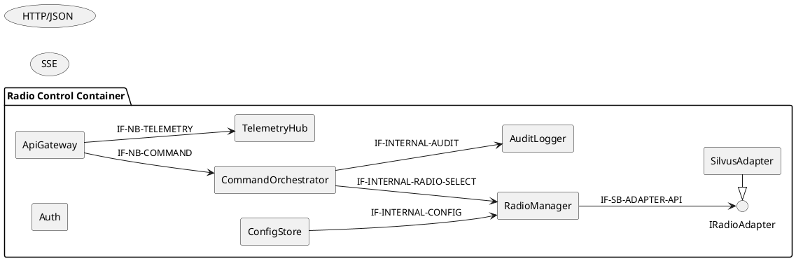
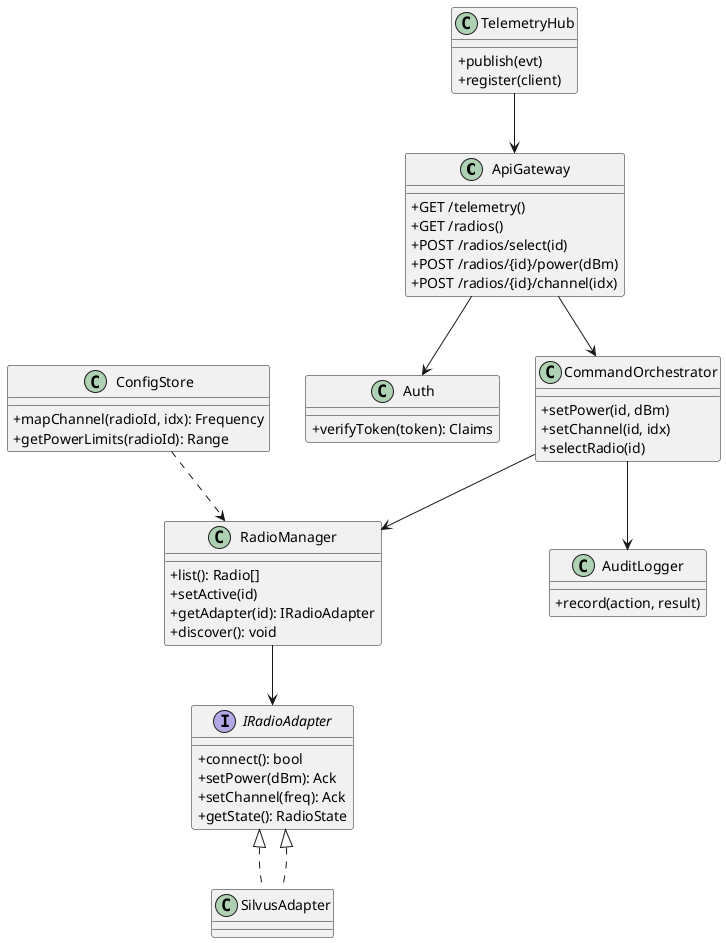
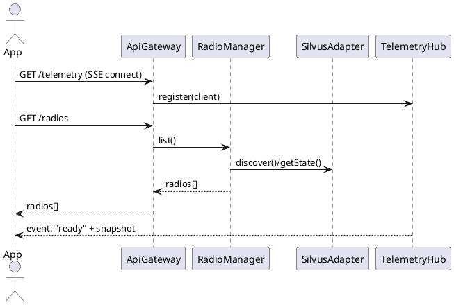
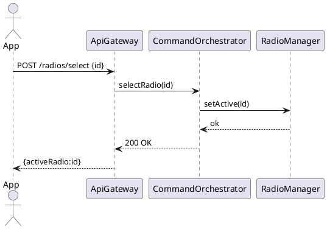
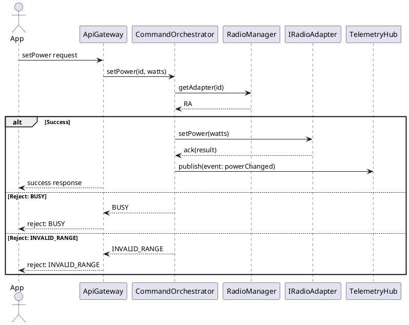
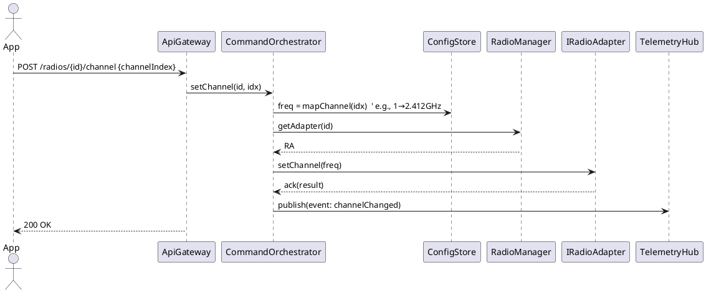
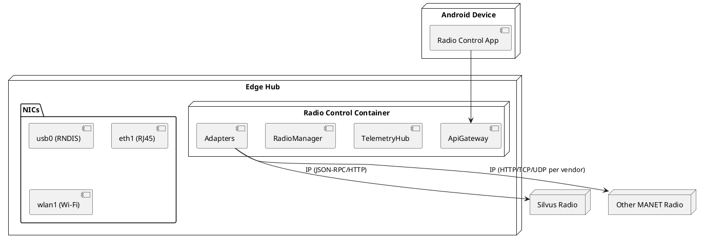
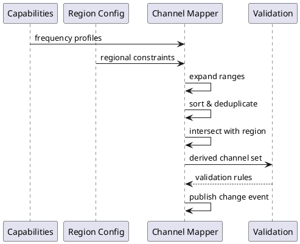

# Radio Control Container – Architecture Documentation (IEEE 42010 + arc42)

> Draft v0.1 — for review and collaborative editing. Scope: Radio Control **Container** (edge service) used by the Android Radio Control App to control connected tactical radios (e.g., Silvus) via the Hub.

**Configuration Baseline**: This document references **CB-TIMING vX.Y** as the single source of numeric timing and cadence parameters.

---

## 1. Introduction & Goals (arc42: Section 1)

**Purpose.** Define a clear, reviewable, and implementable architecture for the **Radio Control Container** that exposes control & telemetry to the Android App. This document follows **ISO/IEC/IEEE 42010** (stakeholders, concerns, viewpoints, views) and **arc42** (sections 1–12). It uses the Silvus ICD for interface alignment where applicable (placeholders included where exact ICD clauses will be referenced once confirmed).

**Primary functional goals (End‑User level):**

- Select which connected radio to control.
- View and change **Channel**.
- View and change **Power**.

**Non‑functional goals:**

- **Low power** edge operation; minimize CPU/wireless use.
- **Resilience** to intermittent links; automatic recovery.
- **<100 ms** command response (local link, no congestion).
- **Auditability** of control actions (who/when/what).
- **Security** appropriate for field use (authZ/authN, least privilege).

**Out of scope (this version):** spectrum management, mission planning, RF geo‑awareness, crypto keying, over‑the‑air firmware updates.

---

## 2. Stakeholders & Concerns (IEEE 42010)

| Stakeholder                       | Concerns                                                                              |
| --------------------------------- | ------------------------------------------------------------------------------------- |
| Field Operator (Android App user) | Simple, reliable radio selection; quick channel/power changes; clear feedback/errors. |
| Squad Leader / C2                 | Control audit, basic telemetry (state, faults), consistent behavior across radios.    |
| System Integrator                 | Clean interfaces to multiple radio vendors; ICD compliance; testability.              |
| Security Officer                  | Access control, logging, transport security, hardening, no debug backdoors.           |
| DevOps / Maintainer               | Deployability (containerized), observability, configuration management, rollback.     |

**Primary concerns:** latency, reliability on flaky networks, battery impact, multi‑radio heterogeneity, ICD alignment, offline buffering/retry, minimal dependencies.

---

## 3. System Scope & Context (arc42: Section 3)

**Context (textual)**

- **Android Radio Control App** ⟷ **Radio Control Container (Edge Hub)** ⟷ **Tactical Radios** (e.g., Silvus).
- Radios are connected via Hub interfaces (Ethernet/USB RNDIS/Wi‑Fi) and controlled with **native vendor IP protocols** per ICD.

### Context Diagram (Authoritative)

```plantuml
@startuml
skinparam shadowing false
skinparam componentStyle rectangle
left to right direction

actor "Field Operator
(Android App)" as Operator
node "Edge Hub" as Hub {
  component "Radio Control Container" as RCC
}
node "Silvus Radio" as Silvus
node "Other Radio" as Other

Operator --> RCC : HTTP/JSON cmds
SSE telemetry
RCC --> Silvus : Silvus ICD (Derived)
(JSON-RPC/HTTP or TCP)
RCC --> Other : Vendor ICD (IP/TCP/UDP)
@enduml
```

**External Interfaces**

- **App ↔ Container (northbound):**
  - **Commands:** small HTTP/JSON endpoints (REST‑like) for *setPower*, *setChannel*, *selectRadio*.
  - **Telemetry:** **Server‑Sent Events (SSE)** stream for state updates, channel/power confirmations, faults.
- **Container ↔ Radios (southbound):**
  - **Silvus:** Silvus ICD (Derived) – concrete message names/fields per our reduced ICD.
  - **Other radios:** vendor **IP protocols** (TCP/UDP/HTTP) via adapters, each honoring vendor ICDs.

---

## 4. Solution Strategy (arc42: Section 4)

### 4.1 Key Design Decisions

- **ADR‑001 (Protocol for App ↔ Container)**: **SSE for telemetry**, small **HTTP/JSON** endpoints for commands.\
  Rationale: matches unidirectional streaming need with minimal overhead; robust to intermittent links; simple to implement; complements command endpoints.
- **Forward‑compatible transport abstraction**: telemetry is published via an internal `TelemetryPublisher` interface so we can add **WebSocket** and **MQTT** publishers later **without changing payload schemas** or command endpoints. Non‑breaking additions: `GET /telemetry/ws` (WS upgrade) and MQTT topics `rcc/v1/<radioId>/events/<eventType>`.
- **Capability negotiation**: `GET /capabilities` returns available telemetry transports (e.g., `["sse"]` today, later `["sse","ws","mqtt"]`).
- **Adapter pattern** for radio heterogeneity; retain native protocols to avoid expensive translation layers.
- **Stateless command endpoints + idempotent handlers**; **stateful telemetry** via SSE with auto‑reconnect.
- **Command budget:** target **<100 ms** local RTT (no WAN), retries with exponential backoff.
- **Security:** local bearer token + mTLS optional; role‑based scopes (view, control).

### 4.2 Constraints

- Battery‑powered edge.
- 5–10 concurrent App connections.
- Intermittent links (Wi‑Fi/mesh).
- Mixed native protocols; some radios only offer serial control.

---

## 5. Building Block View (arc42: Section 5)

**Top‑Level Components**

- **API Gateway (Northbound)**: HTTP endpoints for commands; SSE endpoint for telemetry.
- **Session & Auth**: token validation, scopes, rate limiting.
- **Radio Manager**: registry of connected radios; selection & capability discovery.
- **Command Orchestrator**: validates & routes *setChannel*, *setPower*, *selectRadio*.
- **Telemetry Hub**: multiplexes radio events → SSE clients; buffers for reconnects.
- **Radio Adapters (per vendor)**: speak native IP protocols (e.g., SilvusAdapter via JSON‑RPC/HTTP).
- **Audit Logger**: immutable action log; optional local ring‑buffer.
- **Config Store**: channels map, power profiles, radio metadata.

### Interface Identification Diagram



**Class/Component sketch (PlantUML)**



### Responsibilities per Component (RACI‑style focus)

| Component               | Primary Responsibilities                                                                                                                                          |
| ----------------------- | ----------------------------------------------------------------------------------------------------------------------------------------------------------------- |
| **ApiGateway**          | Expose northbound HTTP/JSON commands and SSE endpoint; translate HTTP requests into orchestrator calls; throttle per client.                                      |
| **Auth**                | Validate bearer tokens; enforce scopes (`radio:read`, `radio:control`).                                                                                           |
| **RadioManager**        | Maintain inventory of radios (id, model, capabilities); discovery; hold active‑radio state; provide adapters (see §5.6).                                                     |
| **CommandOrchestrator** | Validate requests (ranges, permissions); resolve channel index → frequency via ConfigStore; call adapter methods; emit events to TelemetryHub; write AuditLogger. |
| **TelemetryHub**        | Fan‑out events to all SSE clients; buffer last N events per client for reconnection (Last‑Event‑ID).                                                              |
| **AuditLogger**         | Append‑only action log with user, radioId, params, outcome, timestamp.                                                                                            |
| **ConfigStore**         | Channel maps per radio/band; power limits; hot‑reload with signature verification.                                                                                |
| **IRadioAdapter**       | Stable API contract all adapters must implement.                                                                                                                  |
| **SilvusAdapter**       | Implement Silvus ICD (Derived) commands: `SetTxPower`, `SetChannelFreq`, `GetStatus`; handle Silvus acknowledgments and error codes.                              |

### 5.6 Radio Discovery & Lifecycle

**Startup:** Accept **configured inventory and/or capability read** to establish liveness and ingest capabilities.

**Runtime:** **Duty-cycled** liveness checks per §8.3a; no continuous polling. Probe cadences and backoff policies are defined in **CB-TIMING v0.3**.

**Loss & Re-attach:** On loss, publish event; on re-attach, re-ingest capabilities and **re-derive** channels.

**Identity:** Stable `radioId` across reconnects; how it is obtained is **implementation-specific**.

**Capability Refresh:** When radios re-attach or capabilities change, the system shall re-ingest supported frequency profiles and re-derive channel mappings per §13.

---

## 6. Runtime Scenarios (arc42: Section 6)

### 6.1 Initialization



### 6.2 Choose Radio



### 6.3 Set Power



**Note:** Retry behavior and operator feedback follow §8.3/§8.5 policies.

### 6.4 Set Channel (Map 1..N → Frequencies)




## 7. Deployment View (arc42: Section 7)

- **Containerized service** running on the **Edge Hub** (Linux).
- Radios present as **IP devices** via various transport mechanisms.
- Android App connects over local Wi‑Fi/mesh to the Container's API.

**Southbound Transport Requirements**

The system must support multiple radio connection types with per-radio addressability and traffic separation. The specific networking mechanism is implementation-specific.

**Container networking**

Deployment shall ensure per-radio addressability and correct separation of traffic even with overlapping subnets; the specific networking mechanism is implementation-specific.



## 8. Cross-Cutting Concepts (arc42: Section 8)

> This section is normative and references §7 (Deployment), §9 (Interfaces), §10 (Quality), §12 (ADRs), §13 (Channel Map), and §14 (Security Model). It defines security, commissioning, timing, error handling, configuration, observability, and testing rules that apply system-wide.

### 8.1 Security & Auth
- **AuthN**: Bearer tokens (short-lived); optional mTLS.
- **AuthZ**: Roles `viewer`, `controller`.
- **Audit**: Record user, radioId, action, parameters, result, timestamp (see §8.6 for log schema).
- **Hardening**: Disable unused adapters and vendor mgmt ports; least-privilege file/system access.

### 8.2 Commissioning (Air-Gapped Profile)
- **Threat model**: Dismounted, air-gapped; no WAN/Internet reachability.
- **Controls**:
  - Bind northbound HTTP API to **127.0.0.1** (or **Unix domain socket**) when UI is co-resident.
  - Host firewall **default DROP**; explicit allow for UI loopback.
  - Device **whitelist by VID:PID** (driver loads only for certified IDs).
  - Post-**zeroize** re-provision checklist (credentials, config, region file).
- **Audit**: Minimal local audit file (rotated) for **set/get** actions.

### 8.3 Resilience & Timing

The system implements event-first telemetry with duty-cycled health probing to minimize power consumption while maintaining predictable control behavior. Health probes operate in three states (Normal, Recovering, Offline) with state-specific cadences and backoff policies. Disruptive operations enter bounded recovery periods during which new commands are queued. Command execution is bounded by class-specific timeouts. Event replay is supported via Last-Event-ID with configurable buffer retention.

All timing parameters, cadences, timeouts, and buffer sizes are defined in **CB-TIMING v0.3** and may be tuned without changing this architecture. The system shall avoid continuous polling and implement opportunistic, bounded probe strategies.

### 8.3a Power-Aware Operating Modes (Edge Profile)

**Objective:** Minimize device power draw while preserving predictable control and telemetry behavior.

1) **Event-First Policy**  
   - The system shall prefer **change-driven** telemetry. When no changes occur, only a low-rate heartbeat is permitted.

2) **Duty-Cycled Probing (3 states)**  
   - **Normal**: low probe cadence suitable for steady state.  
   - **Recovering**: temporarily increased cadence until healthy, then drop back to Normal.  
   - **Offline**: exponentially increasing intervals up to a maximum; probe budget shall be bounded.

3) **Probe Budget & Backoff**  
   - Probe intervals, backoff ceilings, and jitter windows are defined in **CB-TIMING v0.3**.  
   - Implementations shall avoid continuous polling; probes are **opportunistic** and **bounded**.

4) **Operator-Triggered Reads**  
   - Parameter reads (e.g., power, freq) should be **on-demand** when the operator acts, not on a ticking loop.

5) **Heartbeat Cap**  
   - A heartbeat shall be emitted only to preserve liveness semantics; idle cadence shall be capped per **CB-TIMING v0.3**.

6) **Multi-Radio Independence**  
   - Power policies apply per radio. A recovering or offline device must not increase load on healthy devices.

**Rationale:** Edge deployments have strict power budgets. Event-first + duty-cycled probing minimizes unnecessary wakeups and radio transactions.

### 8.4 Configuration (Region/Channel Policy)
- **Source of truth**: `supported_frequency_profiles` **+ signed region config**.
- **Channel map**: UI channels **1..N** derived from the region config; illegal selections blocked **client-side** and **server-side**.
- **Power profiles**: Named presets → watts; limits enforced per radio capability.

### 8.5 Error Model & Normalization
- **Container codes**: `OK`, `BAD_REQUEST`, `INVALID_RANGE`, `BUSY`, `UNAVAILABLE`, `INTERNAL`.
- **Normalized mapping (architecture-level)** — transport/HTTP mapping is specified in the OpenAPI:

| Vendor error (string/object) | Container code | Notes                                 |
|------------------------------|----------------|---------------------------------------|
| _(malformed JSON)_           | `BAD_REQUEST`  | Structural parse error; fix request.  |
| `"OUT_OF_RANGE"`, `{...}`    | `INVALID_RANGE`| Fix params and re-submit.             |
| `"BUSY"`, `{...}`            | `BUSY`         | Use backoff per §8.3.                 |
| `"UNAVAILABLE"`, `{...}`     | `UNAVAILABLE`  | Radio rebooting/soft-boot; retry.     |
| `"INTERNAL"`, `{...}`        | `INTERNAL`     | Retry with jittered backoff.          |
| _(none on set success)_      | `OK`           | Vendor set typically returns `[""]`.  |

### 8.5.1 Vendor Error Format Ambiguity

Radio vendors may return errors in **textual** or **structured** formats. The system shall provide deterministic mapping into the normalized set `{INVALID_RANGE, BUSY, UNAVAILABLE, INTERNAL}` while preserving diagnostic information.

**Normalization Requirements:**
- Each vendor error must map to exactly one container code plus a human-readable message.
- The original vendor payload shall be preserved in a **diagnostic details** field (opaque to the client).
- Mapping logic shall be consistent across adapter implementations.
- Error envelope fields are defined in the **OpenAPI** specification; this section covers normalization rules only.

### 8.6 Observability & Logs
- **Health endpoints**: `/health` (liveness/readiness).
- **Metrics**: command latency, SSE clients, adapter error counts.
- **Log schema** (minimum): `timestamp`, `actor`, `action`, `result`, `latency_ms`.
- **Rotation**: max file size and retention count defined in **CB-TIMING v0.3**.

### 8.7 Testing & Conformance
- **Adapter conformance**: methods implemented; units & side-effects honored; error mapping covered; timing budgets observed.
- **Golden traces**: Channel/Power happy path + 3 error cases (range, busy/soft-boot, unavailable).
- **Contract tests**: Event payload schemas (telemetry) and command envelopes must remain stable across transports (see ADR-001).

### 8.8 Concurrency & Serialization

**Per-radio serialization**: At most one in-flight control command per radio; others queue FIFO.

**Recovering gate**: While recovering, do not dispatch new control commands to that radio.

**Timeouts & capacity**: Defined in **CB-TIMING v0.3**; failures map via §8.5 normalization.

**Independence**: Commands to different radios are independent.

## 9. Interfaces & Data Models (arc42: Section 9)

### 9.1 Northbound API (HTTP/JSON + SSE)

Commands via a request/response API; telemetry via a streaming API (SSE today) — see OpenAPI/Telemetry spec.

### 9.2 Southbound Silvus Adapter – ICD (Derived)

Adapters shall conform to the Logical ICD; see ICD doc for tables.

### 9.3 SSE Event Stream

Telemetry events include `ready`, `state`, `channelChanged`, `powerChanged`, `fault` — see Telemetry spec for payload schemas.

### 9.4 Data Types

Core entities include Radio (id, model, capabilities), Channel (index, frequency), Power (watts), and State (status, faults) — see OpenAPI spec for schemas.

---

## 10. Quality Scenarios (arc42: Section 10)

1. **Latency:** Command `setChannel` processed and acknowledged via SSE within **<100 ms** (95th percentile) under 5 concurrent clients on local mesh.
2. **Resilience:** After Wi‑Fi drop, App reconnects SSE within 5 s and receives missed events using `Last-Event-ID`.
3. **Battery:** Container CPU <5% idle, <20% under burst (10 commands/min + 1 Hz telemetry).
4. **Security:** Unauthorized client cannot invoke control endpoints; all denied actions are logged.

---

## 11. Risks & Technical Debt (arc42: Section 11)

- Vendor protocol ambiguity until ICDs are fully confirmed.
- Vendor IP API differences (JSON‑RPC vs REST vs custom TCP/UDP) may require robust normalization and backoff handling.
- Channel mapping must prevent illegal frequencies by region/mode.
- SSE intermediaries (proxies) must preserve streaming semantics.

Mitigations: adapter stubs + contract tests; strict validation; proxy bypass on edge; config signing.

---

## 12. Architecture Decisions (arc42: Section 12)

### ADR‑001 — Client API Communication Protocol Selection

**Status:** Accepted (2024-01-15)\
**Decision:** **SSE** for telemetry; **HTTP/JSON** for commands.\
**Drivers:** translation overhead, battery efficiency, resilience, heterogenous device protocols, need for continuous telemetry, implementation flexibility.\
**Alternatives considered:** WebSockets, gRPC streaming, MQTT, CoAP Observe, long‑polling.\
**Consequences:** Simpler client & server; unidirectional stream means commands stay on request/response; good reconnection story; keep native radio protocols unchanged.

**Related Decision:** Air-gapped auth artifacts are pre-provisioned/short-lived; details in §14 and **OpenAPI** security section.

**Migration Guidance (Forward‑Compatibility):**

- Telemetry is published via an internal `TelemetryPublisher` abstraction. Adding **WebSocket** or **MQTT** is a **non‑breaking** extension that preserves event payload schemas.
- **Discovery/Negotiation:** `GET /capabilities` advertises available transports (initially `["sse"]`; later may include `"ws"`, `"mqtt"`).
- **Endpoint Additions (non‑breaking):** `GET /telemetry/ws` (HTTP upgrade) and MQTT topics `rcc/v1/<radioId>/events/<eventType>`.
- **Contract Freeze:** Command endpoints and event payload schemas are specified in **OpenAPI v1** (commands) and **AsyncAPI v1** (telemetry). Transport changes MUST NOT alter payload schemas.
- See companion specs: *Radio Control API – OpenAPI v1* and *Radio Control Telemetry – AsyncAPI v1*.

### ADR‑002 — Channel Index Base Selection

**Status:** Accepted (2025-01-15)\
**Decision:** Use **1-based indexing** for channel indices.\
**Drivers:** Human-centric interface design, soldier usability, intuitive channel selection.\
**Alternatives considered:** 0-based indexing (programmer-centric), mixed indexing.\
**Consequences:** Soldiers refer to "channel 1" not "channel 0"; UI displays natural numbering; channel derivation maps 1→N to frequency lists; precedence rule applies when both frequency and index provided.

**Rationale:** Field operators are human users who naturally think in 1-based terms. A soldier says "switch to channel 1" not "switch to channel 0". This decision prioritizes usability over programming convention.

### ADR‑003 — Error Normalization Strategy

**Status:** Accepted (2025-01-15)\
**Decision:** Normalize vendor errors to container error codes via adapter layer.\
**Drivers:** Adapter heterogeneity, cleaner client experience, consistent error handling across radio vendors.\
**Alternatives considered:** Pass-through vendor errors, vendor-specific error handling, client-side normalization.\
**Consequences:** Adapters must implement normalization logic; vendor errors preserved in diagnostic details; clients receive consistent error codes; error mapping must be maintained per vendor.

**Rationale:** Different radio vendors return errors in different formats (string vs object, different codes). Normalization provides a consistent client experience while preserving diagnostic information for troubleshooting. This approach scales better than client-side error handling.

---

## 13. Channel Index → Frequency Mapping

**Purpose:** Map human channel indices to physical frequencies for a radio & region combination.

**Sources:** Radio capabilities (frequency profiles) ∩ regional constraints (Config).

**Profile Forms:** 
- Uniform range: `start:step:end` (MHz) 
- Explicit list: individual frequency values

**Derivation Process:**
1. Expand range specifications into explicit frequency lists
2. Sort and deduplicate frequencies
3. Intersect with regional legal constraints
4. Produce ordered set with 1-based indices

**Indexing:** 1-based indices for user contexts; if both **frequencyMHz** and **channelIndex** are provided upstream, frequency takes precedence.

**Validation:** Reject inputs outside the derived set; tolerance parameters defined in **CB-TIMING v0.3**.

**Refresh:** Recompute on capability or region changes; publish a change event.

**Precedence Rule:** When both frequencyMhz and channelIndex are provided, frequency takes precedence for validation and execution.



---

## 14. Security Model (detail)

**Threat model**: Local mesh/Wi-Fi, insider risk, device loss.

**AuthN**: Short-lived or pre-provisioned artifacts are required; issuance is deployment-specific.

**AuthZ**: Two roles (`viewer`, `controller`) with least-privilege policy; reference **OpenAPI** for role bindings to operations.

**Audit**: Minimal action logging without PII.

**Hardening**: Non-functional controls (surface minimization, role scoping).

### 14.1 Privacy Considerations

**Non-PII Data** (safe to log and transmit):
- Radio model, capabilities, status
- Frequency, power settings (tactical parameters)
- Command timestamps, error codes
- System performance metrics
- Radio connectivity status

**Potentially Sensitive Data** (handle per deployment policy):
- GPS coordinates (if used for radio positioning)
- Radio serial numbers (if logged for asset tracking)
- Operator identifiers (if beyond role name)
- Network topology information
- Mission-specific frequency assignments

**Data Classification**:
- **Public**: Radio capabilities, supported frequencies, power ranges
- **Internal**: System status, error logs, performance metrics
- **Confidential**: GPS coordinates, serial numbers, operator details
- **Restricted**: Mission-specific configurations, cryptographic keys

**Retention Policies**:
- **Log files**: See **CB-TIMING v0.3** §11 for rotation policies
- **Audit logs**: Minimal retention for security events only
- **Telemetry data**: Real-time only, no persistent storage
- **Configuration**: Encrypted storage with access controls

**Privacy Controls**:
- **Data minimization**: Collect only necessary operational data
- **Purpose limitation**: Use data only for radio control functions
- **Access controls**: Role-based access to sensitive data
- **Encryption**: Sensitive data encrypted in transit and at rest
- **Anonymization**: Remove identifying information where possible

**Compliance Considerations**:
- **Deployment-specific**: Privacy policies must align with operational requirements
- **Data sovereignty**: Consider data residency requirements
- **Retention limits**: Implement automatic data purging
- **Audit trails**: Track access to sensitive data

---

## 15. Correspondence to IEEE 42010

| IEEE 42010 Element      | Where in this doc                                                                                     |
| ----------------------- | ----------------------------------------------------------------------------------------------------- |
| Stakeholders & Concerns | §2                                                                                                    |
| System Context          | §3                                                                                                    |
| Viewpoints & Views      | arc42 sections §5–§7 provide logical/runtime/deployment views with PlantUML sketches                  |
| Rationale/Decisions     | §4 and §12 (ADR‑001)                                                                                  |
| Correspondence Rules    | Adapters must implement `IRadioAdapter`; API must expose endpoints as in §9; telemetry via SSE (§9.2) |

---

## 16. Implementation Notes

- Language/runtime: TBD; containerized with minimal image.
- CI: adapter simulation + golden traces; latency budgets enforced in tests.
- Config: signed JSON; hot‑reload with validation.

---

## 17. Silvus ICD (Derived) — Canonical Tables

See ICD doc for authoritative method tables, transport details, and error conventions.

---

## 18. Glossary

- **SSE (Server‑Sent Events):** HTTP streaming for server→client updates.
- **Adapter:** module that translates Container commands to a vendor’s native protocol.
- **Active Radio:** radio currently targeted by default control commands.
- **ICD:** Interface Control Document (vendor‑specific).

---

## 19. Minimal API Examples

See OpenAPI v1, Annex A (Examples).

---

> **Review Checklist (for this draft)**
>
> -

