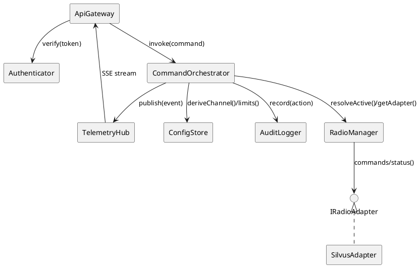

# Radio Control Container – C++ Module Design Notes

This document extracts the component responsibilities and interface expectations
from `../docs/radio_control_container_architecture_v1.md` and captures how they
map onto the forthcoming C++20 implementation. The goal is to ensure a faithful
translation of the IEEE 42010 + arc42 architecture into concrete modules that
reuse the shared infrastructure provided by `dts-common`.

## Architectural Alignment

- **Northbound API** exposes HTTP/JSON commands and SSE telemetry in accordance
  with ADR-001 and the OpenAPI/AsyncAPI specifications.
- **Southbound Adapter Layer** speaks vendor-native protocols (Silvus first),
  normalizing errors per ADR-003.
- **Cross-cutting concerns** (resilience, security, observability, audit) follow
  the normative guidance in Sections §8–§14 of the architecture document.

## Module Breakdown

### API Gateway (`src/api`)
- **Responsibilities**
  - Register REST endpoints: `GET /radios`, `POST /radios/select`, `POST
    /radios/{id}/power`, `POST /radios/{id}/channel`, `GET /capabilities`,
    `GET /health`.
  - Manage SSE telemetry endpoint (`GET /telemetry`) and propagate Last-Event-ID
    tokens.
  - Enforce per-client throttling and request validation (basic structural checks
    before delegating to orchestrator).
  - Integrate with authentication middleware for bearer token extraction.
- **Key Classes**
  - `rcc::api::Router` – owns a `dts::common::rest::Router` instance and wires
    route handlers.
  - `rcc::api::Handlers` – orchestrator-facing handlers implementing business
    logic bridging HTTP to core services.
  - `rcc::api::SSEEndpoint` – thin wrapper around `dts::common::telemetry::SSEServer`
    to register telemetry channels.
- **Interfaces**
  - Depends on `rcc::auth::Authenticator`, `rcc::command::Orchestrator`,
    `rcc::telemetry::Hub`.

### Authentication & Authorization (`src/auth`)
- **Responsibilities**
  - Validate bearer tokens (JWT HS256 per current deployment) using
    `dts::common::security::JwtVerifier`.
  - Enforce scopes `radio:read` and `radio:control`.
  - Surface audit context (actor, scopes) downstream.
- **Key Classes**
  - `rcc::auth::Authenticator` – validates token, returns claims structure.
  - `rcc::auth::AuthorizationGuard` – helper invoked by handlers to enforce
    scope requirements.
- **Interfaces**
  - Provides `AuthContext verify(const HttpRequest&)`.
  - Consumed by API and telemetry modules.

### Telemetry Hub (`src/telemetry`)
- **Responsibilities**
  - Fan-out events via SSE using `dts::common::telemetry::EventBus` and
    `SSEServer`.
  - Buffer recent events per §8.3 for Last-Event-ID replay.
  - Provide `TelemetryPublisher` abstraction that higher layers use to emit
    events (`ready`, `state`, `channelChanged`, `powerChanged`, `fault`).
- **Key Classes**
  - `rcc::telemetry::EventPublisher` – emits strongly-typed events to the event
    bus.
  - `rcc::telemetry::Hub` – wraps SSE server lifecycle, manages client metrics.
- **Interfaces**
  - `void publish(Event&& evt)` with typed overloads or variants.
  - `void start()` / `void stop()` for lifecycle management.

### Command Orchestrator (`src/command`)
- **Responsibilities**
  - Validate business rules (channel/power ranges, role-based permissions).
  - Resolve channel indices via configuration store (§13) and enforce per-radio
    serialization & retry rules (§8.8).
  - Coordinate telemetry publication (`powerChanged`, `channelChanged`) and audit
    logging.
- **Key Classes**
  - `rcc::command::Orchestrator` – main façade invoked by API handlers.
  - `rcc::command::CommandQueue` – ensures per-radio FIFO execution.
- **Interfaces**
  - `CommandResult setPower(RadioId, PowerRequest, const AuthContext&)`.
  - `CommandResult setChannel(RadioId, ChannelRequest, const AuthContext&)`.
  - `CommandResult selectRadio(RadioId, const AuthContext&)`.

### Radio Manager (`src/radio`)
- **Responsibilities**
  - Maintain inventory of radios (id, model, capabilities) and active selection.
  - Run discovery/liveness probes with duty-cycled cadence (§8.3).
  - Provide adapter lookups and state snapshots for API telemetry.
- **Key Classes**
  - `rcc::radio::RadioManager` – orchestrates discovery, active radio, adapter
    registry.
  - `rcc::radio::DiscoveryService` – schedules probing/backoff using Asio timers.
- **Interfaces**
  - `std::vector<RadioSummary> listRadios() const`.
  - `std::shared_ptr<adapter::IRadioAdapter> getAdapter(const RadioId&)`.
  - `void setActive(const RadioId&)`.

### Configuration Store (`src/config`)
- **Responsibilities**
  - Load and validate region/channel/power configuration from signed YAML/JSON
    assets (§13, §8.4).
  - Derive 1-based channel maps per radio & region.
  - Expose power limits, timing profiles, telemetry retention settings.
  - Support hot-reload with signature verification hooks.
- **Key Classes**
  - `rcc::config::ConfigManager` – loads disk configuration, integrates with
    `dts::common::config` utilities.
  - `rcc::config::ChannelMap` – provides frequency derivation helpers.
- **Interfaces**
  - `const ChannelMap& channelsFor(const RadioId&) const`.
  - `PowerLimits powerLimitsFor(const RadioId&) const`.
  - `TimingProfile timing() const`.

### Audit Logger (`src/audit`)
- **Responsibilities**
  - Record command actions with metadata (`action`, `actor`, `radioId`,
    parameters, result, latency) per §8.6.
  - Support append-only rotation consistent with CB-TIMING policies.
  - Expose hooks for downstream observability/metrics.
- **Key Classes**
  - `rcc::audit::Logger` – wraps `dts::common::logging::StructuredLogger`.
- **Interfaces**
  - `void record(const AuditRecord&)`.

### Adapter Layer (`src/adapter`)
- **Responsibilities**
  - Provide `IRadioAdapter` interface for vendor implementations.
  - Implement `SilvusAdapter` using ICD-derived protocol (JSON-RPC/HTTP or TCP).
  - Normalize vendor errors into container codes (`OK`, `INVALID_RANGE`, `BUSY`,
    `UNAVAILABLE`, `INTERNAL`).
  - Handle connection lifecycle (connect, reconnect, duty-cycled probing).
- **Key Classes**
  - `rcc::adapter::IRadioAdapter` – pure virtual interface.
  - `rcc::adapter::SilvusAdapter` – concrete implementation.
  - `rcc::adapter::AdapterFactory` – resolves adapters based on radio metadata.
- **Interfaces**
  - `AdapterState state() const`.
  - `CommandResult setPower(PowerRequest)`.
  - `CommandResult setChannel(ChannelRequest)`.
  - `TelemetrySnapshot snapshot() const`.

## Shared Infrastructure Usage

- **Asio Event Loop:** Single-threaded `asio::io_context` mirroring other
  containers, with strands where necessary for adapter concurrency.
- **dts-common**
  - `telemetry::EventBus`, `telemetry::RingBuffer`, `telemetry::SSEServer` for
    streaming telemetry.
  - `rest::Router`, `rest::ResponseBuilder` for HTTP endpoints.
  - `security::JwtVerifier`, `security::RateLimiter` for auth hardening.
  - `logging::Logger`, `metrics::Registry` for observability.
  - `core::timestamp`, `core::correlation_id` for envelope consistency.

## Inter-Module Interactions

## Data Contracts & DTOs

- **RadioSummary**: `{ id, model, state, capabilities }`
- **ChannelRequest**: `{ channelIndex?, frequencyMHz?, correlationId }` – 1-based
  indices; frequency takes precedence if both provided (§13).
- **PowerRequest**: `{ watts?, presetName?, correlationId }` – enforce limits via
  `PowerLimits`.
- **Telemetry Events**: `ready`, `state`, `channelChanged`, `powerChanged`,
  `fault` – payloads align with AsyncAPI schemas.
- **AuditRecord**: `{ timestamp, actor, action, radioId, params, result,
  latencyMs }`

## Resilience & Timing Considerations

- **Duty-cycled probing** implemented within `RadioManager::DiscoveryService`
  using timers configured from `TimingProfile`.
- **Per-radio serialization** via `CommandQueue` to ensure only one in-flight
  command per radio (§8.8).
- **Retry policies** (BUSY, UNAVAILABLE) encoded in `CommandOrchestrator` with
  exponential backoff respecting CB-TIMING budgets.
- **Telemetry buffering** uses `telemetry::RingBuffer` size/duration sourced from
  configuration.

## Security & Hardening Hooks

- Bind northbound listeners according to deployment profile (loopback vs
  network) and honor firewall guidance (§8.2).
- Enforce role-based scopes through `AuthorizationGuard`.
- Integrate structured audit logging and optional metrics exporters for security
  monitoring.

## Implementation Notes

- Prefer header-only interfaces (`include/rcc/...`) with implementation in
  `src/...` mirroring other containers.
- Ensure ABI compatibility by defining `DTS_INLINE_NAMESPACE=v1` on targets.
- Follow existing container conventions for configuration paths and log
  directories (e.g., `/etc/rcc/config.yaml`, `/var/log/rcc/` configurable).
- Provide dependency injection for key services (telemetry hub, audit logger)
  to facilitate unit testing.

